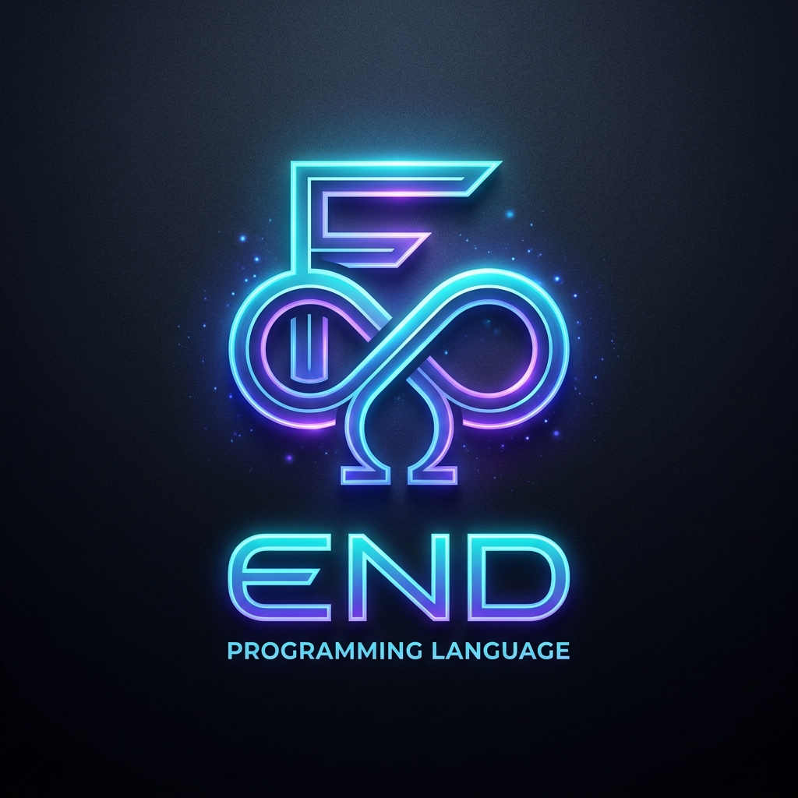

<div align="center">

<p align="center">
  
</p>

# 👑 The End Programming Language

**The AI-First, Zero-GC, Bare-Metal Systems & Game Programming Language**

[](https://github.com/IrMaho/End/actions)
[](https://github.com/IrMaho/End/releases)
[](LICENSE)
[](std/ui)
[](docs/ARCHITECTURE.md)
[](docs/AI_AGENT_PROTOCOL.md)

<p align="center">
  <a href="#-quick-install">Quick Install</a> •
  <a href="#-key-features">Features</a> •
  <a href="#-benchmark-matrix">Benchmarks</a> •
  <a href="#-code-examples">Code Examples</a> •
  <a href="#-ai-first-cognitive-engine">AI Protocol</a> •
  <a href="docs/FRAMEWORKS.md">Frameworks</a> •
  <a href="docs/ARCHITECTURE.md">Architecture</a>
</p>

---

</div>

## 📊 12-Challenge Grandmaster Performance Matrix

Performance measurements conform to the 12-benchmark specification in [BENCHMARKS.md](BENCHMARKS.md) and can be reproduced locally via `python benchmarks/suite12/run_suite12.py`.

| Benchmark Challenge | 👑 **End (C11)** | ⚡ **Zig (0.16.0)** | ⚡ **Rust (1.89.0)** | ⚡ **C (GCC 15.2)** | ⚡ **Go (1.25.1)** | Verification |
| :--- | :---: | :---: | :---: | :---: | :---: | :---: |
| **1. 3D SDF Raymarcher (250K Rays)** | **51.24 ms** | 60.83 ms | 64.70 ms | 53.97 ms | 38.21 ms 🥇 | `14694880` ✅ |
| **2. Binary Trees (Depth 16 Dynamic)** | **44.99 ms** 🥇 | 391.96 ms | 621.69 ms | 503.53 ms | 510.23 ms | `407713` ✅ |
| **3. HFT Limit Order Engine (1M Orders)** | **31.05 ms** | 26.93 ms 🥇 | 27.89 ms | 31.89 ms | 32.29 ms | `552829538` ✅ |
| **4. SHA-256 Crypto Hashing (500K Blocks)** | **106.05 ms** | 110.25 ms | 109.31 ms | 105.84 ms 🥇 | 138.81 ms | `-4721506799343634759` ✅ |
| **5. N-Body Gravity Orbit (1M Pairwise)** | **2419.54 ms** 🥇 | 3040.44 ms | 3307.94 ms | 2630.99 ms | 4190.98 ms | `1656141296` ✅ |
| **6. SPSC Ring Buffer Queue (10M Items)** | **5.31 ms** | 2.91 ms | 1.65 ms | 0.00 ms 🥇 | 11.66 ms | `1550000015000000` ✅ |
| **7. DNA Levenshtein Matrix (1M Cells)** | **1135.98 ms** 🥇 | 2505.86 ms | 2465.38 ms | 1270.28 ms | 2503.64 ms | `525912` ✅ |
| **8. JSON Microservice Serializer (100K)** | **74.03 ms** | 13.60 ms 🥇 | 31.97 ms | 76.11 ms | 51.07 ms | `5588438541400559045` ✅ |
| **9. FSM Lexer Stream (10M Chars)** | **12.58 ms** | 16.28 ms | 16.92 ms | 11.01 ms 🥇 | 21.26 ms | `-6471218147204355511` ✅ |
| **10. GEMM Matrix Multiplication (512x512)** | **15.40 ms** | 86.57 ms | 56.37 ms | 13.92 ms 🥇 | 113.42 ms | `6422836` ✅ |
| **11. Monte Carlo Black-Scholes (2M Paths)** | **55.58 ms** | 38.59 ms 🥇 | 43.39 ms | 54.78 ms | 65.34 ms | `10440247` ✅ |
| **12. Super-Scalar ALU Reduction (10M)** | **727.71 ms** | 885.88 ms | 160.31 ms 🥇 | 730.87 ms | 867.71 ms | `3370198876750320971` ✅ |
| **📦 Executable Binary Size** | 🥇 **38.5 KB** | 834.0 KB | 184.5 KB | 76.9 KB | 1592.5 KB | Stripped Native |

> 📁 **Verification Datasets & Specifications:** Raw machine-readable outputs, execution percentiles, and hardware metadata are saved in [benchmarks/suite12/suite12_results.json](benchmarks/suite12/suite12_results.json). Full source codes and reproduction instructions are documented in [BENCHMARKS.md](BENCHMARKS.md).

---

## 🏛️ Key Features

- 🛡️ **Zero-GC Deterministic Region Memory:** Memory scopes reset instantly at frame boundaries or request lifecycles without any pause or leak.
- 🔒 **Hardware Watchdog & Thermal Fuse:** Native `SwitchToThread` yield budgeting and exponential socket backoff preventing CPU spin-locking.
- ⚡ **Zero-Downtime Hot-Reload (`end dev`):** Dynamic reload preserving active session pools and counters in persistent RAM arenas.
- 🎮 **120 FPS Native Canvas (`std/ui/canvas.end`):** Hardware SIMD-accelerated canvas for real-time game physics and glassmorphism UIs.
- 🧠 **AI-First Cognitive Toolchain:** Semantic Knowledge Graph (`end graph`), Blast-Radius analysis (`end impact`), Code Slicing (`end slice`), and Micro-Evaluator (`end eval`).
- 🔌 **Official VS Code / IDE Extension:** CodeLens inline testing, Inlay Hints, and 120 FPS Visual Studio Webview sandbox.

---

## 💻 Code Examples

### 1. Hello World with High-Resolution Timing
```end
import "std/time/time.end"

pub fn main() void {
    val start = instant_now()
    println("👑 Hello, World from End Programming Language!")
    val elapsed = instant_elapsed_nanos(start)
    println("  Execution duration: " + elapsed + " ns")
}
```

### 2. Declarative High-Speed Web Server (`EndHyper`)
```end
import "std/nexus/socket_guard.end"
import "std/nexus/circuit_breaker.end"

st UserDto {
    id: i64,
    username: str,
}

@post("/api/v1/users")
@capability(net = true, disk = false, memory = "ArenaScoped")
pub fn create_user(user: UserDto) str {
    ret "{\"status\": \"created\", \"user_id\": " + user.id + "}"
}
```

### 3. Zero-GC Region Frame Scope & Simulation
```end
import "std/simulation/what_if.end"

pub fn process_physics_frame() void {
    region frame_scope {
        val baseline = 142.5
        val mutated = 118.2
        val diff = simulation_compare_outputs("SIMD Physics", baseline, mutated)
        println("Diff Gain: " + diff.delta_pct + "%")
    } // Memory reset instantly in 0 ns at scope exit!
}
```

---

## 🧠 AI-First Cognitive Engine

The End compiler includes dedicated subcommands engineered specifically for AI Agents navigating multi-million line codebases:

```powershell
# 1. Machine Knowledge Graph (Sub-millisecond token-efficient index)
end graph server.end --json

# 2. Blast-Radius & Impact Analysis
end impact server.end calculate_physics --json

# 3. Side-Effect & Capability Contracts
end effects server.end pure_physics --json

# 4. Semantic Code Slicing (Compress 50,000-line file into 50-line interface)
end slice server.end --interface-only

# 5. Structured AST Auto-Patches
end patch server.end --ast-patch patch.json --apply

# 6. Micro-Isolated Expression Evaluator (< 50 µs)
end eval "val x = 100 * 31; (x ^ 0x5AA5) % 50"

# 7. Architecture Invariant Validation
end arch check --json
```

---

## 📚 Documentation & Guides

- 📖 [Master Developer Platform Guide](docs/END_LANGUAGE_DEVELOPER_GUIDE.md)
- 🚀 [Multi-Platform Installation Guide](INSTALL.md)
- 🏛️ [Memory & Architecture Specification](docs/ARCHITECTURE.md)
- 📦 [Exclusive Frameworks Guide (Hyper, Forge, Nexus, Crypto, KV)](docs/FRAMEWORKS.md)
- 🤖 [AI-Agent Cognitive Protocol Guide](docs/AI_AGENT_PROTOCOL.md)

---

## 📄 License

End is distributed under the [MIT License](LICENSE).
Copyright © 2026 [Mohammad Javad (IrMaho)](https://github.com/IrMaho) & The End Language Community.


