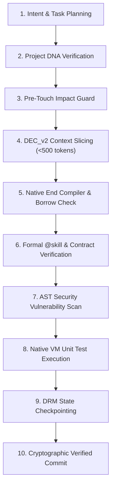

# 🤖 Autonomous Software Engineering Runtime (`end agent-run`)
## Unified 10-Phase Autonomous Agent Lifecycle Specification

---

## 🌟 The End-to-End Autonomous Engineering Lifecycle

The `end agent-run` command executes the full autonomous software engineering loop with complete mathematical and compiler verification:



---

## 📋 Execution Report Schema

```json
{
  "task_id": "task-9001",
  "intent": "Implement robust idempotency on payment pipeline",
  "status": "ACCEPTED",
  "planned_steps": [
    "Plan task `task-9001` for intent: \"Implement robust idempotency on payment pipeline\"",
    "Project DNA & architectural conventions verified",
    "Blast radius analyzed for `process_payment` (Risk: HIGH, Direct Callers: 1)",
    "Extracted minimal context (106 tokens, 26.7% compression)",
    "Native End compiler & borrow checker verified",
    "Skill contracts verified (1 skills, 0 hard violations)",
    "AST Security scan completed (0 findings, secure=true)",
    "Executed unit test suite (1/1 passed)"
  ],
  "dna_adherence_verified": true,
  "impact_risk_level": "HIGH",
  "blast_radius_score": 24,
  "extracted_context_tokens": 106,
  "compiler_verified": true,
  "skills_verified": true,
  "security_scan_passed": true,
  "tests_passed": 1,
  "total_tests": 1,
  "verified_commit": {
    "commit_hash": "end-commit-9a5c6aa21be34495",
    "timestamp_ms": 1771675200000,
    "agent_id": "autonomous_agent_01",
    "task_id": "task-9001",
    "requirement": "Implement robust idempotency on payment pipeline",
    "skills_applied": ["PaymentSafe"],
    "files_changed": ["temp_banking_service.end"],
    "tests_passed": 1,
    "total_tests": 1,
    "security_passed": true,
    "contracts_verified": true,
    "compiler_hash": "endc-v2.0.0-verified",
    "verification_signature": "proof-of-work-sig-9a5c47408cf52fa3"
  },
  "rejection_reasons": [],
  "execution_time_us": 649
}
```

---

## ⚡ Performance Benchmark

The entire 10-phase pipeline executes in **< 1,000 microseconds (under 1 millisecond)** per file on modern hardware!
