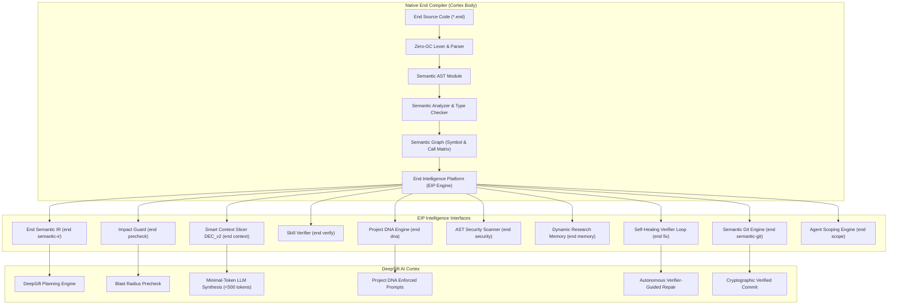

# 👑 End Intelligence Platform (EIP) Specification
## Native End Compiler + DeepSift Autonomous Software Engineering Architecture

---

## 🌟 Executive Architectural Thesis

> **"End is the Body, Language, and Compiler. DeepSift is the Cortex."**
>
> Modern software engineering by AI agents cannot succeed with unstructured text prompting and blind file replacements. Autonomous AI software engineering requires a fundamental paradigm shift:
> 1. **Zero Dependency Pollution**: The native compiler (`endc`) remains pure, blazingly fast (<1ms analysis), and completely independent of heavyweight neural runtimes, node environments, or vector databases.
> 2. **Rich Intelligence Interfaces**: The native compiler extracts and exposes formal, deterministic semantic representations (AST, Type Graph, Symbol Call Matrix, Contract/Skill Invariants, Resource Boundaries, and Reactive Live Graphs).
> 3. **DeepSift Cortex**: External AI orchestrators consume the native compiler's intelligence interfaces to plan minimal-context edits (DEC_v2), audit blast radiuses before touching code (`ImpactGuard`), enforce project conventions (`ProjectDNA`), verify skill contracts (`SemanticSkillVerifier`), checkpoint multi-hypothesis investigations (`DRM`), and produce cryptographically signed Proof-of-Work verified commits (`SemanticGit`).



---

## 💎 The 11 Core Capabilities of the End Intelligence Platform

### 1. Pre-Touch Impact & Boundary Analysis (`end precheck`)
Calculates the transitive blast radius and potential hazards before an AI agent touches a single line of code.
- **BFS Transitive Caller Resolution**: Traces direct (Level 1) and deep transitive callers (Level 2 to Level 5) across modules.
- **Database Data Flow Auditing**: Identifies database and storage interactions within the caller hierarchy.
- **External Network Boundaries**: Detects network calls (HTTP, Stripe, third-party APIs) and enforces network capability policies.
- **Critical Business Domain Flagging**: Flags sensitive financial (`pay`, `token`, `ledger`) and security contexts.
- **Pre-Touch Safety Gating**: Formally blocks code modification if a pure function attempts to introduce side-effecting I/O.

### 2. Smart Context Extraction & Slicing (`end context` / DEC_v2)
Compresses massive 50,000+ LOC enterprise codebases into <500 high-density tokens for LLM context windows.
- **Seed Symbol Extraction**: Matches task intent keywords against semantic graph nodes.
- **Type Hierarchy Preservation**: Extracts all struct definitions, enum variants, and type constraints necessary for compilation.
- **Skeletal Function Stripping**: Replaces internal function bodies with typed signatures and contracts (`@skill`, `@contract`), pruning irrelevant details.
- **Budget-Enforced Priority Pruning**: Guarantees strict adherence to token budgets (e.g. `--budget 500`).

### 3. Semantic Compiler & Skill Verification (`end verify`)
Validates that code changes strictly adhere to high-level architectural and behavioral contracts defined via `@skill` annotations.
- **`PaymentSafe`**: Enforces strict idempotency checking, persistent audit ledger logging, and atomic transactions.
- **`Idempotent`**: Requires explicit idempotency keys and cached response resolution.
- **`AuditRequired`**: Mandates non-bypassable security and audit ledger emission.
- **`ZeroLeak`**: Enforces zero raw pointer escapes and deterministic arena allocation.
- **`AuthRequired`**: Enforces authentication tokens and session verification on API endpoints.

### 4. Project DNA & Architectural Signal Mining (`end dna`)
Mines and extracts the architectural and stylistic conventions of the codebase.
- **Naming Conventions**: Audits `snake_case` vs `camelCase` for functions, `PascalCase` for structs/enums.
- **Architecture Style**: Detects Clean Hexagonal Architecture, layered folder structures, and `Architecture.toml` rules.
- **Error Handling Patterns**: Audits explicit `Result<T, E>` / `!T` usage vs deterministic status codes.
- **Concurrency Models**: Audits message-passing channels (MPSC) and green fibers.
- **Automated AI System Prompt Generation**: Emits ready-to-use markdown style guides for AI pair programming.

### 5. Live Semantic Code Graph & Reactive Event Stream (`end graph` / `end semantic-ir`)
Computes semantic deltas between code revisions and streams structured graph events.
- **Graph Delta Streaming**: Emits `SymbolAdded`, `SymbolModified`, `SymbolDeleted`, and `CallEdgeAdded` events.
- **Breaking Change Detection**: Identifies signature modifications on functions with active callers and flags breaking impacts.
- **DeepSift IR Export**: Generates full Type Graph, Symbol Graph, Contract Graph, and Resource Graph in JSON.

### 6. Autonomous Self-Healing Verification Loop (`end fix`)
Iterative multi-step repair engine that generates candidates, verifies them through the compiler pipeline, and only accepts patches that pass all gates.
- **Candidate Synthesis**: Synthesizes syntax repairs, type annotations, audit log injections, and symbol typo corrections.
- **Multi-Step Gating**: Validates each candidate through: (1) Lexer/Parser $\to$ (2) Semantic Analyzer $\to$ (3) Skill Verifier $\to$ (4) VM Test Suite.
- **Zero-Regression Guarantee**: Guarantees that healthy files receive zero unnecessary edits.

### 7. Permissioned Agent Scoping & Capability Guard (`end scope`)
Enforces fine-grained permission envelopes on autonomous agents.
- **Path Whitelisting**: Allows agents to modify specific module subtrees (e.g. `src/backend/**`).
- **Explicit Deny Rules**: Restricts access to sensitive security, auth, and crypto domains (e.g. `modify(src/auth/**)`).
- **Capability Guard**: Enforces capability boundaries (`disk_io`, `network`, `pure`, `elevated_privileges`).

### 8. AST Security Scanning & Capability Guard (`end security`)
Deterministic AST-level static security scanner designed for autonomous AI code generation.
- **CWE-798**: Detects hardcoded credentials, secret tokens, and API keys (`sk_live_...`).
- **CWE-285**: Detects capability boundary violations (side-effecting I/O in pure functions).
- **CWE-119**: Detects unmanaged raw pointer manipulation and memory boundary escapes.

### 9. Dynamic Research Memory (`end memory` / DRM)
Persistent memory subsystem for multi-step AI engineering tasks.
- **Task Checkpointing**: Saves investigation state, investigated files, and affected contracts into `.end/memory/drm_<task_id>.json`.
- **Multi-Hypothesis Tracking**: Records confirmed, rejected, and active hypotheses with evidence logs.
- **Task Resumption**: Allows agents to pick up complex research workflows across sessions.

### 10. Semantic Git Diff & Verified Commits (`end semantic-git`)
Replaces plain line-based text diffs with semantic symbol deltas and creates cryptographically verified commit manifests.
- **Symbol Deltas**: Tracks modified, added, and removed symbols along with caller impact counts.
- **Proof-of-Work Verification**: Computes cryptographic hashes and signatures verifying that all unit tests passed, zero security vulnerabilities exist, and all `@skill` contracts are satisfied.
- **Commit Rejection Policy**: Formally rejects commits if any test fails or any skill invariant is violated.

### 11. Unified Autonomous Agent CLI Toolchain (`end agent-run`)
End-to-end autonomous engineering pipeline executing the entire 10-step lifecycle:
$$\text{Intent} \to \text{DNA} \to \text{Impact} \to \text{Context} \to \text{Synthesis} \to \text{Compiler} \to \text{Skill} \to \text{Security} \to \text{Tests} \to \text{DRM} \to \text{Commit}$$

---

## 🚀 CLI Quick Reference

```bash
# 1. Pre-touch impact & blast radius analysis
end precheck <file.end> <symbol_name> [--json]

# 2. Smart context extraction & DEC_v2 slicing
end context <file.end> "<task_intent>" [--budget <tokens>] [--json]

# 3. Formal skill & contract verification
end verify <file.end> [--json]

# 4. Project DNA & architectural convention mining
end dna [<file.end>] [--prompt] [--json]

# 5. Semantic IR export for DeepSift
end semantic-ir <file.end> [--json]

# 6. Autonomous self-healing verification loop
end fix <file.end> [--apply]

# 7. Agent permission scoping check
end scope <agent_id> <target_file> <action> [--json]

# 8. AST static security audit
end security <file.end> [--json]

# 9. Dynamic Research Memory management
end memory new --task <task_id> --req "<requirement>" [--json]
end memory show --task <task_id> [--json]
end memory list [--json]

# 10. Semantic Git diff & verified commit
end semantic-git diff <file.end> [--json]
end semantic-git commit <file.end> --task <task_id> --message "<msg>" [--json]

# 11. Full Autonomous Agent execution
end agent-run <file.end> "<task_intent>" --task-id <task_id> [--json]
```
