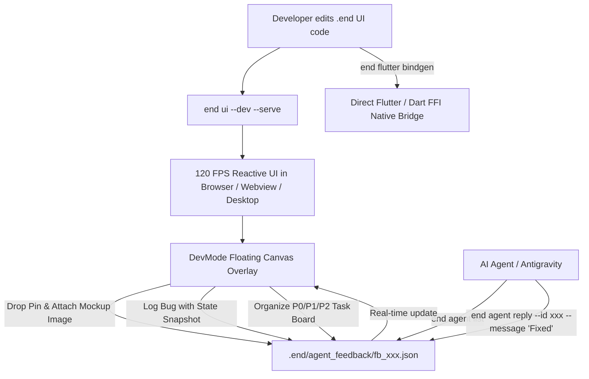

# 🎨 EndUI: Native Declarative UI & Bidirectional AI Agent Canvas Overlay

## 🌟 The Next Generation of Human-Agent Pair Programming for User Interfaces

EndUI brings Flutter-grade declarative UI ergonomics directly into the End Programming Language, combining **120 FPS Zero-Alloc compiled performance** with a **Bidirectional Visual DevMode Overlay** designed specifically for human developers and AI pair-programming agents.



---

## ⚡ 1. Flutter-Grade Declarative Syntax in End

Build rich UI components with declarative widget trees:

```end
st Card {
    title: str,
    subtitle: str,
    button_action: str
}

/// @widget
pub fn App() Card {
    ret Card {
        title: "⚡ EndUI Universal AI Dashboard",
        subtitle: "Compiled to Native Machine Code with 120 FPS High-DPI Canvas Rendering",
        button_action: "Explore System Metrics"
    }
}
```

---

## 🤖 2. Interactive AI DevMode & Canvas Overlay

Start the interactive developer server with:
```bash
end ui src/app.end --dev --serve --port 3000 --open
```

### Key Developer Features on the Live UI:
1. **📍 Visual Pin Drop & Inspection:**
   - Click anywhere on the rendered UI to drop an annotation pin on any widget (`Card`, `Button`, `Row`, etc.).
   - Write instructions for the AI Agent (e.g. *"Change this button to a gradient and add 12px padding"*).
2. **🖼️ Assign Mockup Images & Figma References:**
   - Attach reference URLs or local image mockups directly to the annotation pin so the AI agent knows the exact visual target.
3. **📋 Live Task & Priority Board:**
   - Manage tasks with **P0 (Blocker)**, **P1 (High)**, and **P2 (Normal)** priorities directly on top of the live UI.
4. **🐛 One-Click Bug & State Snapshot:**
   - Log errors and UI state regressions straight into the `.end/agent_feedback/` queue.

---

## 🔄 3. Bidirectional AI Agent CLI Protocol

The AI Coding Agent seamlessly connects to the developer's live canvas via CLI subcommands:

```bash
# List all active developer feedback, image mockups, and tasks
end agent list

# Machine-readable JSON output for automated agent reasoning
end agent list --json

# Reply to a developer's annotation and resolve task
end agent reply --id "fb_1787300100" --message "Updated Card styling with deep cyan-indigo gradient and verified 120 FPS render target" --status "Resolved"
```

---

## 🐦 4. Direct Flutter & Dart FFI Interop

To integrate with existing Flutter mobile/desktop apps, generate zero-overhead Dart FFI bridges with:

```bash
end flutter bindgen src/app.end -o lib/generated
```

This generates:
- `end_flutter_bridge.dart` with `DynamicLibrary` loading across Windows (`.dll`), Android/Linux (`.so`), and iOS/macOS (`dylib`).
- Ready-to-use Flutter `StatelessWidget` / `StatefulWidget` wrappers that invoke native End routines at C-speed!
