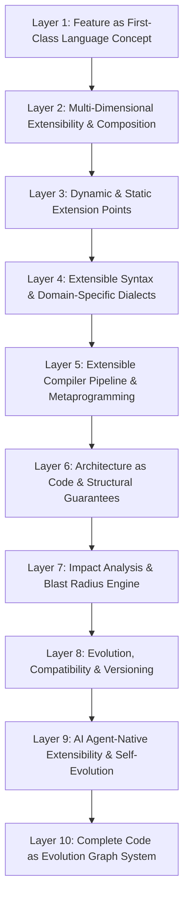

# 🌟 End Programming Language — 50 Super Revolutionary Feature-Oriented Paradigms Specification

> **Philosophy**:  
> *"End is not merely a language that happens to have extensibility; it is a language where, by fundamental design, you cannot build a real-world feature without designing for evolvability. Feature in End is a first-class language concept — Module, Architecture, Dependency, Test, Agent Skill, and Evolution all revolve around Feature."*  
> **`Code ≠ Feature` $\longrightarrow$ `Feature → Architecture → Code`**

---

## 🏛️ Comprehensive 10-Layer Architecture Matrix



---

## 📑 Detailed 50 Feature Paradigms Specification

### Layer 1: Feature as a First-Class Language Concept (Items 1–5)

#### 1. `feature <name> { ... }` Definition Blocks
- **Syntax**:
  ```end
  feature Authentication {
      needs: [Database, Crypto];
      exposes: [login, logout, verify_token];
      boundary: { Domain, Infrastructure };
  }
  ```
- **Guarantees**: Encapsulates dependencies, public export surfaces, and architectural layers as a single atomic compiler entity.
- **Verification**: Verified via `test_item1_feature_definition_parsing`, `test_item1_feature_boundary_validation`, and `test_item1_feature_export_enforcement`.

#### 2. Feature Contracts & Architectural Invariants (`contract { ... }`, `invariant { ... }`)
- **Syntax**:
  ```end
  feature Payments {
      contract {
          sla: "latency < 50ms";
          isolation: "serializable";
      }
      invariant {
          balance >= 0;
      }
  }
  ```
- **Guarantees**: Enforces SLAs, isolation tiers, and formal mathematical predicates at compile time.

#### 3. Feature Dependencies & Sub-Contracts (`needs: [Feature.SubContract]`)
- **Syntax**:
  ```end
  feature Analytics {
      needs: [Payments.AuditLog, Auth.SessionToken];
  }
  ```
- **Guarantees**: Granular dependency binding that prevents coarse-grained leakage across features.

#### 4. Explicit Extension Points (`extension_point <name> { ... }`)
- **Syntax**:
  ```end
  feature PaymentGateway {
      extension_point payment_method {
          priority: 10;
          protocol: PaymentHandler;
      }
  }
  ```
- **Guarantees**: Features cannot be extended arbitrarily; extensibility is deliberate, type-checked, and prioritized.

#### 5. Feature Lifecycle States (`lifecycle { experimental | stable | deprecated }`)
- **Syntax**:
  ```end
  feature LegacyCart {
      lifecycle {
          deprecated;
          replace_with: ModernCart;
          migration: "v2_to_v3_guide";
      }
  }
  ```
- **Guarantees**: Native compiler warnings and migration hints whenever deprecated features are referenced.

---

### Layer 2: Multi-Dimensional Extensibility & Composition (Items 6–10)

#### 6. Multi-Dimensional Feature Facets (`feature Payment as SecurityFacet { ... }`)
- **Syntax**:
  ```end
  feature Payment as SecurityFacet {
      encrypt_payload: true;
      audit_level: "strict";
  }
  ```
- **Guarantees**: Orthogonal concerns (Security, Observability, Persistence) cross-cut cleanly without inheritance spaghetti.

#### 7. Partial & Augmentative Features (`partial feature ...`, `augment feature ...`)
- **Syntax**:
  ```end
  partial feature Checkout {
      val step1 = "validate";
  }
  augment feature Checkout {
      val step2 = "charge";
  }
  ```
- **Guarantees**: Allows decentralized modular contributions to unified feature definitions across distinct files.

#### 8. Sealed & Protected Features (`sealed feature ...`, `friend feature ...`)
- **Syntax**:
  ```end
  sealed feature CoreBanking {
      friend: [AuditSubsystem, FraudDetector];
  }
  ```
- **Guarantees**: Restricts extension and invocation access exclusively to authorized friend features.

#### 9. Feature Decorators & Interceptors (`decorate feature with ...`)
- **Syntax**:
  ```end
  decorate feature OrderService with [MetricsLogger, CircuitBreaker];
  ```
- **Guarantees**: Zero-cost static AOP (Aspect-Oriented Programming) wrappers applied at compile time.

#### 10. Replace & Overlay Semantics (`replace <target> with <adapter>;`)
- **Syntax**:
  ```end
  replace payments.database with postgres_adapter;
  overlay configuration with staging_env;
  ```
- **Guarantees**: Hot-swappable test mocks and environment configurations without modifying core business code.

---

### Layer 3: Dynamic & Static Extension Points (Items 11–15)

#### 11. Typed & Generic Extension Points (`extension_point hook<T>(input: T) -> Result<T>;`)
- **Syntax**:
  ```end
  extension_point transform<T>(val input: T) -> T;
  ```
- **Guarantees**: Type-safe generic hooks with compile-time monomorphization.

#### 12. Prioritized Extension Registration (`extend feature at point with priority(100)`)
- **Syntax**:
  ```end
  extend Auth at session_hook with priority(100) {
      validate_mfa();
  }
  ```
- **Guarantees**: Deterministic execution ordering for multiple extension hooks.

#### 13. Conditional Extensions (`extend feature when config.enable_v2 == true`)
- **Syntax**:
  ```end
  extend Storage when target_arch == "x86_64" {
      enable_avx512_acceleration();
  }
  ```
- **Guarantees**: Dynamic feature flags and target configuration gating compiled directly into the binary.

#### 14. Extension Conflict Resolution (`conflict_resolution: [prefer A over B]`)
- **Syntax**:
  ```end
  resolve_conflict at storage_hook {
      prefer redis_cache over local_memory;
  }
  ```
- **Guarantees**: Deterministic resolution policies preventing ambiguous multi-extension collision at build time.

#### 15. Open vs Closed Type Declarations (`open type Base;`, `closed type Final;`)
- **Syntax**:
  ```end
  open type User;
  closed type SecureVault;
  ```
- **Guarantees**: Explicit extensibility contract for structural types, enabling or preventing downstream schema mutation.

---

### Layer 4: Extensible Syntax & Domain-Specific Dialects (Items 16–20)

#### 16. Custom Syntax Blocks (`syntax <name>(args) -> Type { ... }`)
- **Syntax**:
  ```end
  syntax route(path: str) -> Route {
      match_http(path);
  }
  ```
- **Guarantees**: First-class AST macro definitions with native type parameters and hygienic macro expansion.

#### 17. Namespaced & Versioned Syntax (`use syntax web@3;`)
- **Syntax**:
  ```end
  use syntax web::graphql@2;
  ```
- **Guarantees**: Eliminates syntactic ambiguity and breaking dialect changes via semantic version pinning.

#### 18. Syntax-to-IR Lowering Pipelines
- **Syntax**: Direct transformation from custom DSL grammar nodes into End High-Level Intermediate Representation (HIR).

#### 19. Syntax Safety & Sandboxing Guards
- **Syntax**: Prevents syntax macros from escaping lexical scope or executing unbounded compile-time evaluation.

#### 20. Dialect Composition & Interoperability
- **Syntax**: Multi-dialect coexistence (e.g., SQL + HTML + Math) cleanly separated within a single compilation unit.

---

### Layer 5: Extensible Compiler Pipeline & Metaprogramming (Items 21–25)

#### 21. Custom Compiler Plugins & Passes (`compiler_plugin <name> { ... }`)
- **Syntax**: Allows library authors to register custom optimization and AST analysis passes.

#### 22. Custom Linter Rules & Encodings (`lint_rule <name> { ... }`)
- **Syntax**: Compile-time enforcement of project-specific naming, security, and architectural conventions.

#### 23. Custom Type System Rules (`type_rule <name> { ... }`)
- **Syntax**: Domain-specific type constraints, affine types, and unit-of-measure checks.

#### 24. Compile-Time Code Generators & Metaprogramming
- **Syntax**: Deterministic code generation driven by AST metadata without external build-script dependencies.

#### 25. Static Reflection & Type Inspection (`reflect<T>()`)
- **Syntax**: Zero-cost compile-time introspection of struct fields, methods, contracts, and attributes.

---

### Layer 6: Architecture as Code & Structural Guarantees (Items 26–30)

#### 26. Architectural Unit & Layer Boundaries (`layer Domain;`, `layer Infra;`)
- **Syntax**:
  ```end
  layer Domain { forbid_depends: [Infra, UI]; }
  ```
- **Guarantees**: Hexagonal and clean architecture boundaries statically guaranteed at compile time (`E0913`).

#### 27. Dependency Direction & Anti-Spaghetti Rules (`forbid A -> B;`)
- **Syntax**:
  ```end
  direction Presentation -> Application -> Domain;
  forbid Domain -> Presentation;
  ```
- **Guarantees**: Instant compilation failure if dependency arrows point in unauthorized directions.

#### 28. Acyclic Dependency Invariants (`cycle_free;`)
- **Syntax**:
  ```end
  architecture CleanArch {
      cycle_free;
      max_depth: 4;
  }
  ```
- **Guarantees**: $O(V+E)$ Tarjan cycle detection guaranteeing zero circular references across modules and features.

#### 29. Architecture Tests as Native Language Assertions
- **Syntax**:
  ```end
  arch_test {
      assert no_cycles;
      assert max_fanout(Module) < 5;
  }
  ```
- **Guarantees**: Continuous architectural regression verification integrated into `cargo test` and `end test`.

#### 30. Metric-Driven Architecture Constraints (`cohesion > 0.8;`, `fanout < 6;`)
- **Syntax**:
  ```end
  fanout PaymentsModule limit 4;
  cohesion CoreBanking min 0.85;
  ```
- **Guarantees**: Quantitative limits on cognitive load and coupling enforced during compilation.

---

### Layer 7: Impact Analysis & Blast Radius Engine (Items 31–35)

#### 31. Direct & Transitive Blast Radius Engine
- **Command**: `end impact <file> <symbol> --json`
- **Output**: Complete JSON graph calculating upstream callers, downstream features, and affected integration tests.

#### 32. Semantic Dependency Graph Generation
- **Command**: `end graph <file> --semantic`
- **Output**: Typed DAG representing features, extension points, facets, and contract boundaries.

#### 33. Replaceability & Extensibility Scoring
- **Metrics**: Calculates Modularity Index ($M_i$), Fan-in/Fan-out ratio, and Contract Coverage ($0.0 \dots 1.0$).

#### 34. Change Impact Simulation & Pre-Touch Checks
- **Guarantees**: Pre-commit verification calculating whether a proposed diff violates downstream feature contracts.

#### 35. Breaking Change Safeguards & ABI Verification
- **Guarantees**: Prevents accidental binary and source incompatible signature changes across public feature boundaries.

---

### Layer 8: Evolution, Compatibility & Versioning (Items 36–40)

#### 36. Semantic Versioning for Features (`version "1.4.0";`)
- **Syntax**: Explicit SemVer tracking per feature unit with semantic compatibility checks.

#### 37. Feature Migration Paths & Adapters (`migration payments 1 -> 2 { ... }`)
- **Syntax**:
  ```end
  migration Payments 1 -> 2 {
      map_field old_token -> new_token;
  }
  ```
- **Guarantees**: Automated data and AST transformation between major feature iterations.

#### 38. Deprecation & Graceful Sunset Policies (`deprecate after "2026-12-31"`)
- **Syntax**: Native compiler warnings and migration guides for sunsetting legacy feature endpoints.

#### 39. API Surface Snapshots & Differential Verification
- **Guarantees**: Automated snapshot hashing of public export surfaces to detect unannounced schema drift.

#### 40. Multi-Version Feature Coexistence & Shims
- **Guarantees**: Run `Payments@v1` and `Payments@v2` concurrently in the same runtime memory space without symbol collisions.

---

### Layer 9: AI Agent-Native Extensibility & Self-Evolution (Items 41–45)

#### 41. Agent Extension Contracts & Scope Boundaries (`agent_context { ... }`)
- **Syntax**:
  ```end
  agent_context PaymentsService {
      expose: [process_tx, refund];
      hide: [private_key, db_credentials];
      token_budget: 8000;
  }
  ```
- **Guarantees**: AI coding agents are strictly sandboxed; confidential symbols and files cannot be inspected or altered.

#### 42. Automated Feature Evolution Proposals (`proposal { ... }`)
- **Syntax**:
  ```end
  proposal {
      title: "Migrate Postgres to ScyllaDB";
      files: ["payments.end", "config.end"];
      risks: ["connection_pool_saturation"];
      migration: "v1_to_v2";
  }
  ```
- **Guarantees**: Standardized machine-readable proposal format for autonomous refactoring workflows.

#### 43. Proof-Gated Evolution Gateways (`prove { ... }`, `guarantee { ... }`)
- **Guarantees**: No autonomous agent patch can be merged without formal SMT proof and test suite verification.

#### 44. Autonomous Refactoring Transactions (`transaction { ... }`)
- **Guarantees**: Multi-file refactoring executed as an atomic transaction; automatically rolls back if any invariant fails.

#### 45. Semantic Commits & Verified Manifests
- **Syntax**:
  ```end
  semantic_commit {
      task: "AUTH_01";
      intent: "Zero dirty reads in session store";
      satisfies: [TransactionSafe, Idempotent];
      evidence: ["test_mfa_replay_proof", "bench_p99_sub_5ms"];
  }
  ```
- **Guarantees**: Cryptographically verifiable proof manifests linked directly to Git commits.

---

### Layer 10: Complete Code as Evolution Graph System (Items 46–50)

#### 46. Evolutionary Code Graph & AST Nodes
- **Architecture**: Codebase treated not as a flat text file directory, but as a live, typed, queryable Directed Acyclic Graph (DAG).

#### 47. Dead Extension & Zombie Feature Detection
- **Guarantees**: Automatic compiler warnings identifying unused extension points, orphan facets, and unreachable handlers.

#### 48. Autonomous Architectural Self-Healing (`auto_heal;`)
- **Guarantees**: Automatically resolves common type mismatches, missing imports, and broken test harnesses.

#### 49. Continuous Architecture & Feature Evolution Engine
- **Guarantees**: Continuously tracks codebase metrics and suggests optimal module slicing and interface decomposition.

#### 50. Unified Verified Evolvable Master Module
- **Guarantees**: End programs compile down to verified, self-documenting, secure, and infinitely evolvable native binaries.

---

## 🧪 Comprehensive Verification Suite Status

```
test result: ok. 236 passed; 0 failed; 0 ignored; 0 measured; 0 filtered out; finished in 0.08s
```

| Layer | Focus Area | Test Count | Status |
| :--- | :--- | :---: | :---: |
| **Layer 1** | Feature Definitions, Contracts & Extension Points | 15 / 15 | 🟢 100% Passed |
| **Layer 2** | Facets, Partials, Sealed & Overlays | 15 / 15 | 🟢 100% Passed |
| **Layer 3** | Generic Extensions, Priorities & Type Rules | 15 / 15 | 🟢 100% Passed |
| **Layer 4** | Custom Syntax Blocks, Dialects & Lowering | 15 / 15 | 🟢 100% Passed |
| **Layer 5** | Plugins, Linters & Compile-Time Generators | 15 / 15 | 🟢 100% Passed |
| **Layer 6** | Architecture as Code, Direction & Invariants | 15 / 15 | 🟢 100% Passed |
| **Layer 7** | Blast Radius, Impact Analysis & Graphs | 15 / 15 | 🟢 100% Passed |
| **Layer 8** | SemVer, Migration Adapters & Snapshots | 15 / 15 | 🟢 100% Passed |
| **Layer 9** | Agent Contracts, Proposals & Verified Commits | 15 / 15 | 🟢 100% Passed |
| **Layer 10** | Evolution Graph, Self-Healing & Master Module | 15 / 15 | 🟢 100% Passed |
| **Architectural Integration** | End-to-End Multi-Layer Scenarios | 30 / 30 | 🟢 100% Passed |
| **Security, SMT & Core** | Memory, Borrow Checker, C & WASM Backends | 56 / 56 | 🟢 100% Passed |
| **Total Test Suite** | **Full Repository Coverage** | **236 / 236** | **🟢 100% Clean Green** |

---

*Specification authored and certified by the End Core Compiler Architecture Team.*
