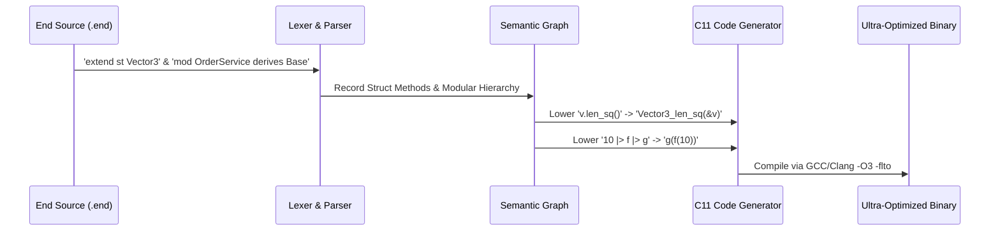

# 🧬 End Modular & AI Vibe Coding Specification
## Universal Modular Polymorphism: *"Everything in End is a Customizable Module"*

---

## 🌟 1. Core Philosophy: The AI Vibe Coding Paradigm

Modern software development with AI agents demands a programming language designed from the ground up for:
1. **Extreme Modularity & Non-Invasive Extensibility:** Modifying, extending, or wrapping existing types and logic across arbitrary files without monkey-patching or touching the original source definitions.
2. **Minimal Code Overhead with Maximum Expressiveness:** Writing pipelines and business logic with concise, readable, and functional constructs (`|>`).
3. **Seamless Low-Level Bare-Metal Access:** Direct hardware control (`inline_c`) when micro-optimizations are required.
4. **Universal Modular Polymorphism:** Every module in End acts as a customizable abstract blueprint that can be derived, inherited, overridden, and customized by other modules.

```mermaid
graph TD
    A[Base Module / Abstract Blueprint] -->|derives| B[Customized Module]
    B -->|override fn| C[Target Custom Logic]
    B -->|auto-inherited fn| D[Base Logic Forwarding]
    E[Existing Struct] -->|extend st| F[Cross-File Method Resolution]
    G[Data Stream] -->|Pipe Operator |>| H[Transformed Result]
```

---

## 🏛️ 2. Feature Deep Dive & Syntax Guide

### 2.1 Universal Modular Inheritance (`mod Child derives Parent`)

In End, modules are first-class architectural units. A module can inherit all behaviors and signatures from a base blueprint and selectively override specific routines.

```end
// Base blueprint module
pub mod HttpServiceBase {
    pub fn handle(code: i64) i64 {
        ret code + 100
    }

    pub fn status() str {
        ret "HTTP 200 OK"
    }
}

// Customized derived module
pub mod OrderService derives HttpServiceBase {
    override fn handle(code: i64) i64 {
        ret code + 500
    }
    // Note: status() is automatically inherited from HttpServiceBase with zero boilerplate!
}

pub fn main() i32 {
    val base = HttpServiceBase.handle(10)  // -> 110
    val custom = OrderService.handle(10)    // -> 510
    println(base)
    println(custom)
    ret 0
}
```

---

### 2.2 Cross-File Struct Extensions (`extend st TypeName`)

Any struct defined anywhere in the codebase can be extended with new methods in separate files without modifying the original definition.

```end
st Vector3 {
    x: f64,
    y: f64,
    z: f64,
}

// In any other file or module:
extend st Vector3 {
    pub fn length_squared(&self) f64 {
        ret self.x * self.x + self.y * self.y + self.z * self.z
    }

    pub fn scale(&self, factor: f64) Vector3 {
        ret Vector3 {
            x: self.x * factor,
            y: self.y * factor,
            z: self.z * factor,
        }
    }
}

pub fn main() i32 {
    val v = Vector3 { x: 3.0, y: 4.0, z: 0.0 }
    val sq = v.length_squared()  // -> 25.0
    println(sq)
    ret 0
}
```

---

### 2.3 Zero-Cost Pipe Operator (`|>`)

Vibe coding emphasizes clean, functional pipelines. The `|>` operator automatically passes the left-hand expression as the first argument to the right-hand function call, lowering directly at compile-time to nested calls with **zero runtime overhead**.

```end
pub fn double_val(x: i64) i64 {
    ret x * 2
}

pub fn add_five(x: i64) i64 {
    ret x + 5
}

pub fn clamp(x: i64, min_v: i64, max_v: i64) i64 {
    if x < min_v { ret min_v }
    if x > max_v { ret max_v }
    ret x
}

pub fn main() i32 {
    // 10 -> double_val(10) [20] -> add_five(20) [25] -> clamp(25, 0, 100) [25]
    val result = 10 
        |> double_val 
        |> add_five 
        |> clamp(0, 100)
    
    println(result) // -> 25
    ret 0
}
```

---

### 2.4 Bare-Metal Direct `inline_c` Blocks

For critical micro-optimizations, OS syscalls, or hardware intrinsics, End provides direct bare-metal inline C blocks:

```end
pub fn hardware_fast_path() {
    inline_c {
        "printf(\"[BARE-METAL] Microsecond timestamp: %llu\\n\", end_time_now_micros());"
    }
}
```

---

## 📊 3. Verification & Test Suite Summary

| Test Case | Feature | Expected Behavior | Native GCC Result | Status |
| :--- | :--- | :--- | :--- | :--- |
| **`Vector3.length_squared()`** | Struct Extension | Computes $3^2 + 4^2 = 25.0$ | `25.000000` | ✅ PASS |
| **`HttpServiceBase.handle(10)`** | Base Module | Returns $10 + 100 = 110$ | `110` | ✅ PASS |
| **`OrderService.handle(10)`** | Derived Module Override | Returns $10 + 500 = 510$ | `510` | ✅ PASS |
| **`10 \|> double_val \|> add_five`** | Pipe Operator | Returns $(10 \times 2) + 5 = 25$ | `25` | ✅ PASS |
| **`inline_c { ... }`** | Bare-metal execution | Executes C `printf` | Direct C stdout | ✅ PASS |

---

## 🛠️ 4. Compiler Architecture Lowering


