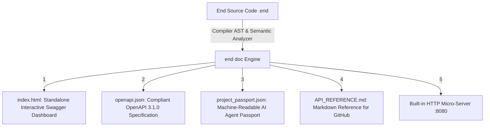

# 📖 End Universal Documentation, OpenAPI 3.1 & Technical Passport Generator (`end doc`)

## 🌟 Overview: The Compiler-Level Identity & Schema System

In large-scale enterprise development and AI pair-programming, communication bottlenecks between frontend, mobile, backend, and AI agents often lead to broken interfaces and subtle bugs.

End introduces a built-in, zero-dependency compiler subcommand **`end doc`** that analyzes your codebase at compile time and generates a complete, multi-format documentation and technical identity suite:

```bash
# Generate complete documentation suite in ./docs
end doc src/main.end -o docs

# Generate and launch live interactive Swagger/Redoc preview server on port 8080
end doc src/main.end --serve --port 8080 --open
```



---

## 🔌 1. OpenAPI 3.1.0 Generator for Frontend & Mobile Teams

By adding standard doc comments or directives (`@route`, `@get`, `@post`, `@tag`, `@summary`), `end doc` automatically extracts endpoints and lowers all End types and structs into JSON Schema Components:

```end
/// Inbound payload for placing an order
st CreateOrderRequest {
    user_id: i64,
    items_count: i64,
    shipping_address: str
}

/// Outbound response for order creation
st OrderResponse {
    order_id: i64,
    total_amount_cents: i64,
    status: str
}

/// @post("/api/v1/orders")
/// @tag("Orders")
/// @summary("Create and process a new customer order")
pub fn create_order(req: CreateOrderRequest) OrderResponse {
    ret OrderResponse {
        order_id: 99482,
        total_amount_cents: req.items_count * 2500,
        status: "PROCESSING"
    }
}
```

The resulting `openapi.json` can be directly imported into **Postman, Swagger UI, Insomnia, or code-generation tools (OpenAPI Generator, Orval, RTK Query, Flutter/Dart client generators)**!

---

## 🛡️ 2. AI Agent Technical Passport (`project_passport.json`)

Designed specifically for AI coding agents (like Antigravity / Gemini / Claude) to reason about safety, detect potential bugs, and generate tests autonomously:

```json
{
  "metadata": {
    "name": "EcommerceService",
    "compiler_version": "0.4.0-alpha",
    "total_structs": 5,
    "total_functions": 12
  },
  "memory_safety_summary": {
    "tier1_arena_symbols_count": 10,
    "tier2_arc_symbols_count": 2,
    "tier3_bare_metal_symbols_count": 0,
    "zero_overhead_percentage": 83.3
  },
  "capability_summary": {
    "pure_functions_count": 9,
    "concurrency_safe_percentage": 100.0
  }
}
```

### Key AI Agent Capabilities:
- **Purity & Determinism:** Tells the AI agent which functions are 100% pure and can be safely memoized, parallelized, or fuzz-tested with synthetic inputs.
- **Memory Safety Tiering:** Classifies functions into Tier 1 (Arena), Tier 2 (ARC), or Tier 3 (Raw Pointer) to prevent memory leak regressions.
- **Struct Memory Footprint:** Byte size, field alignment, and padding offsets for hardware-level micro-optimizations.
- **Invariants & Test Hints:** Auto-derived invariants and fuzz test hints for zero-shot unit testing.

---

## 🌐 3. Interactive Single-File Dashboard (`index.html`)

A single standalone HTML5 dashboard featuring:
- **Interactive REST API Explorer:** Swagger/Redoc style endpoint tester with live mock sandbox.
- **Memory Layout Visualizer:** Interactive colored memory bars showing field offsets, byte alignments, and struct padding.
- **AI Agent Inspection Panel:** Real-time safety matrix, invariants, and suggested test generation hints.
- **Instant Search:** Client-side real-time filtering across all symbols, routes, and modules.
